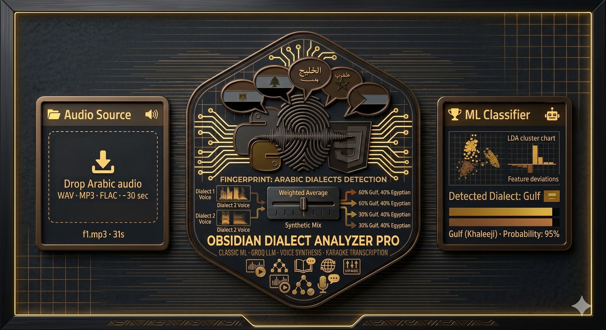
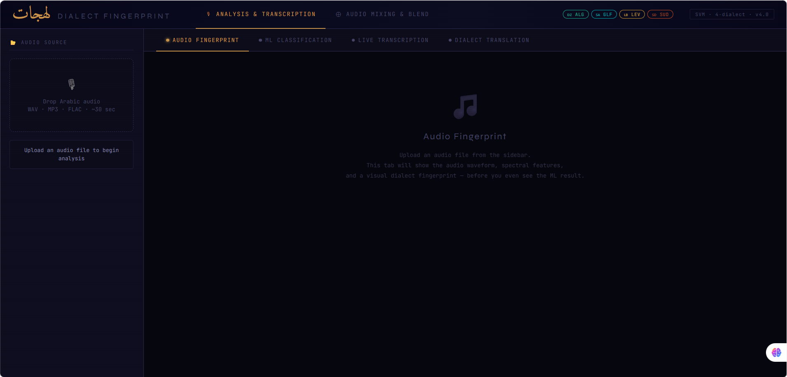
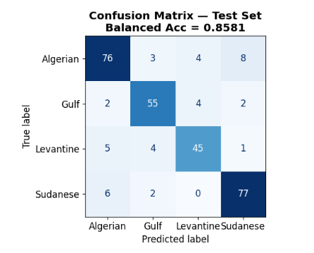
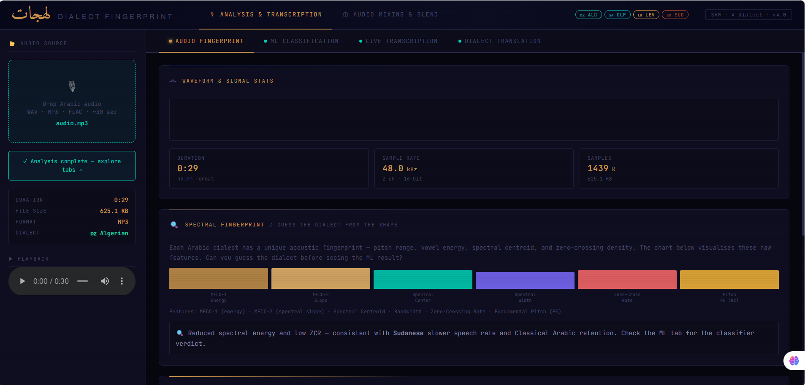
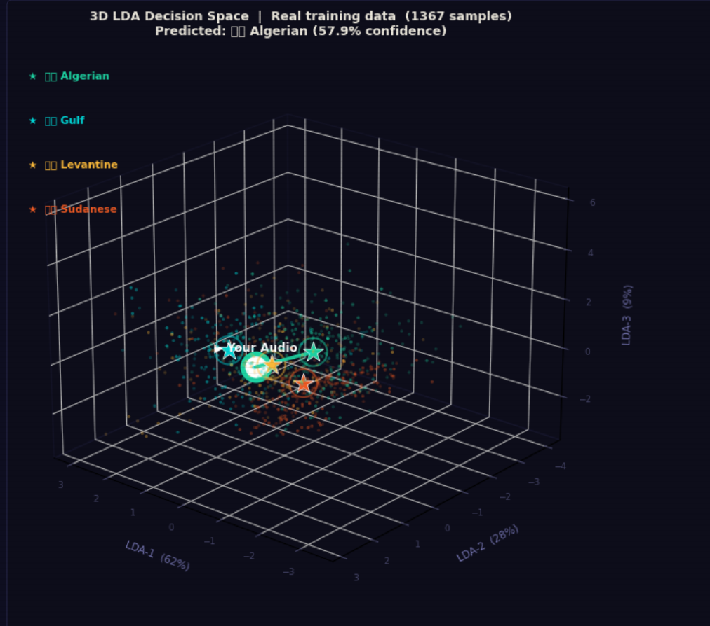
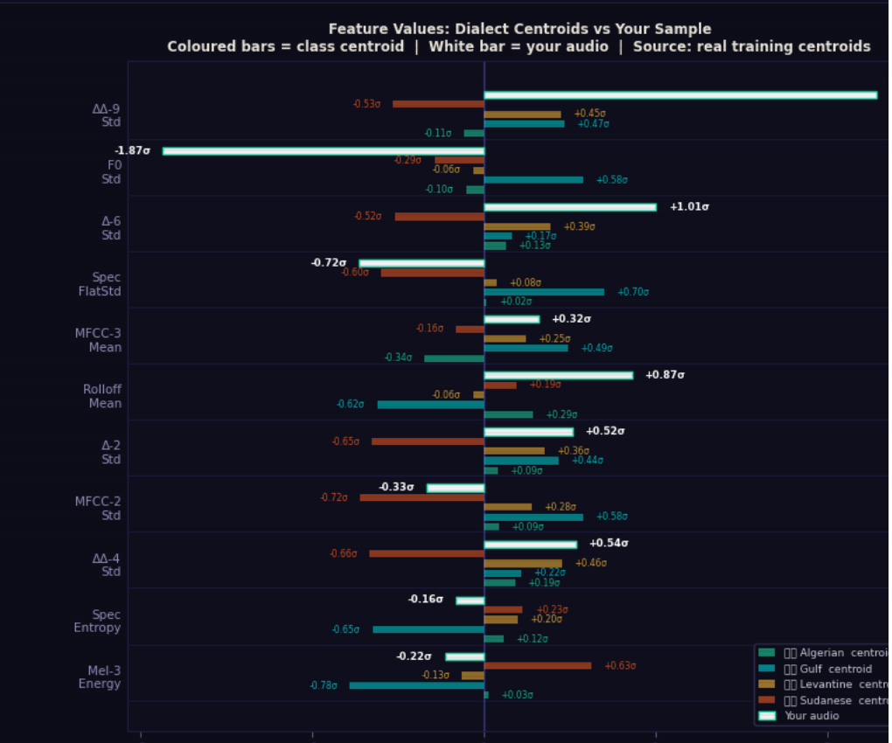
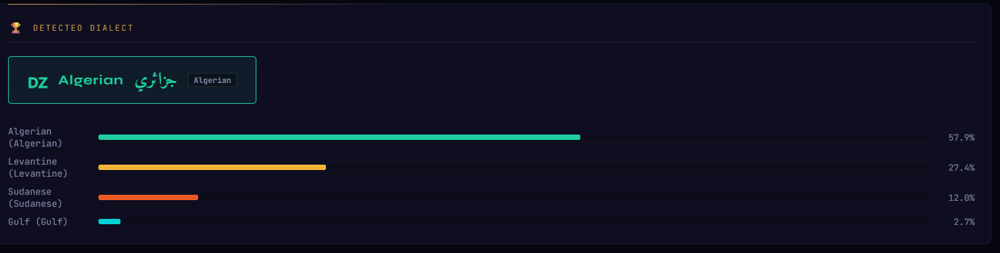
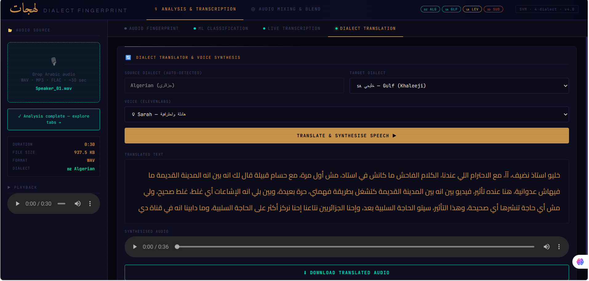

<div align="center">



<br/>

# Lahajat (لهجات)
## Arabic Dialect Fingerprint

> **Your Voice is Your Fingerprint — صوتك بصمتك**

Every Arabic dialect carries a unique acoustic fingerprint hidden in its waveform. This project reveals it.

<br/>


</div>

---

## What is this project?

Imagine uploading an audio file of someone speaking Arabic — you don't need to understand a word to identify the dialect. The system analyzes the **hidden acoustic fingerprint** embedded in the signal itself, extracts 11 precise audio features, and determines the dialect with high accuracy. Then it:

- Renders the **spectrogram** so you can visualize the signal
- Explains **which features drove the decision**
- **Transcribes the speech** word by word in real time
- **Translates** the content into another dialect and synthesizes it as audio
- Lets you **blend two files** from different dialects and analyze the result

All of this with **zero Deep Learning** — 100% Classic Machine Learning.

---

## Supported Dialects

| Code | Dialect | Name | Color | Region |
|------|---------|------|-------|--------|
| `ALG` | Algerian | **Algerian** 🇩🇿 | `#1DD1A1` | North Africa — Algeria |
| `GLF` | Gulf | **Gulf** 🇸🇦 | `#00D2D3` | Arabian Peninsula |
| `LEV` | Levantine | **Levantine** 🇱🇧 | `#F8B739` | Greater Syria — Syria, Lebanon, Jordan |
| `SUD` | Sudanese | **Sudanese** 🇸🇩 | `#EE5A24` | East Africa — Sudan |

---

## File Structure

```
arabic-dialect-fingerprint/
│
├── 📁 backend/
│   ├── 🐍 App.py                    ← Flask server — all endpoints and logic
│   ├── 📦 model_bundle.pkl          ← Trained model (SVM + Scaler + LDA)
│   └── 📓 dialect_classifier.ipynb ← Training notebook — generates model_bundle.pkl
│
├── 📁 frontend/
│   └── 🌐 index.html               ← Complete UI (SPA — single file)
│
├── 📁 audio_samples/               ← Training and testing audio samples
│   ├── 📁 ALG/  speaker_01–04.wav
│   ├── 📁 GLF/  speaker_01–04.wav
│   ├── 📁 LEV/  speaker_01–04.wav
│   └── 📁 SUD/  speaker_01–04.wav
│
├── 📁 assets/
│   ├── 🎨 logo.svg
│   ├── 📸 screenshots/
│   └── 🎬 videos/
│
└── 📄 README.md
```

> **Why this structure?**
> `backend/` keeps all logic, the model, and training together — the notebook generates the `.pkl` that `App.py` loads. `frontend/` is a single self-contained HTML file with no framework dependency.

---

## Table of Contents

1. [The Backend — App.py](#1-the-backend--apppy)
2. [The Frontend — index.html](#2-the-frontend--indexhtml)
3. [Training Notebook](#3-training-notebook)
4. [Feature 1 — File Upload & Spectrogram](#4-feature-1--file-upload--spectrogram)
5. [Feature 2 — Dialect Classification & Charts](#5-feature-2--dialect-classification--charts)
6. [Feature 3 — Real-Time Transcription](#6-feature-3--real-time-transcription)
7. [Feature 4 — Translation & TTS](#7-feature-4--translation--tts)
8. [Feature 5 — Blending & Mixed Signal Analysis](#8-feature-5--blending--mixed-signal-analysis)
9. [Full ML Pipeline](#9-full-ml-pipeline)
10. [The 11 Audio Features — Detailed Breakdown](#10-the-11-audio-features--detailed-breakdown)
11. [API Reference](#11-api-reference)
12. [Installation & Running](#12-installation--running)
13. [Tools & Dependencies](#13-tools--dependencies)

---

## 1. The Backend — App.py

This file is the heart of the project. Written in **Flask**, it receives requests from the browser, processes audio, runs the model, and returns results.

### Core responsibilities:

```
App.py
 ├── b64_to_audio()          ← converts base64 audio to numpy array at 16kHz
 ├── extract_features()      ← extracts all 11 features using librosa
 ├── classify_audio()        ← runs SVM and returns dialect + probabilities
 ├── make_spectrogram()      ← renders the spectrogram as a PNG via matplotlib
 ├── make_feature_chart()    ← renders 3D LDA scatter + Feature Bar Chart
 ├── elevenlabs_stt()        ← sends audio to ElevenLabs Scribe and returns transcript
 ├── groq_translate()        ← sends text to Groq LLaMA-3 and returns translation
 ├── elevenlabs_tts()        ← converts text to audio using ElevenLabs Multilingual
 └── audio_to_b64()          ← converts synthesized audio to base64 for the browser
```

### Core constants:

```python
SR         = 16000   # Sampling rate — 16,000 samples per second
DURATION   = 30      # Take only the first 30 seconds of any file
N_FFT      = 1024    # FFT window size
HOP_LENGTH = 256     # Hop between consecutive windows
N_MFCC     = 13      # Number of MFCC coefficients
N_MELS     = 8       # Number of Mel filter banks
```

> ⚠️ **Important:** These constants must exactly match what was used during training in the notebook. Any mismatch will cause incorrect model outputs.


---

## 2. The Frontend — index.html

A single HTML file that implements a complete **Single Page Application** with no React or framework dependency. It contains 3 pages navigated via the header.

### Design System:

```css
/* Core colors */
--bg: #06060f;           /* Cosmic black background */
--accent: #c8934a;       /* Arabic gold — primary element */
--teal: #00d4b8;         /* Teal — for highlights */

/* Dialect accent colors */
--alg: #1DD1A1;          /* Algerian — green */
--glf: #00D2D3;          /* Gulf — cyan */
--lev: #F8B739;          /* Levantine — gold */
--sud: #EE5A24;          /* Sudanese — orange */

/* Fonts */
--font-ar:   'Cairo'           /* Arabic body text */
--font-mono: 'JetBrains Mono'  /* Code and numbers */
--font-ser:  'Amiri'           /* Arabic calligraphic title */
--font-disp: 'Syne'            /* English display headings */
```

### Application Pages:

| Page | Name | Purpose |
|------|------|---------|
| Page 1 | ANALYSIS | Upload a single file and run full analysis |
| Page 2 | MIX & COMPARE | Blend two files and analyze the mixed signal |
| Page 3 | TRANSLATE & TTS | Translate text to another dialect and generate audio |

<div align="center">

<br/>
<sub><i>Screenshot 2 — App home screen. Shows the cosmic dark theme with Arabic gold, the three navigation tabs in the header, dialect color pills (ALG/GLF/LEV/SUD), and the file upload area in the sidebar.</i></sub>
</div>

---

## 3. Training Notebook

The file `dialect_classifier.ipynb` generates `model_bundle.pkl`. Run it once and `App.py` will load it automatically.

### What happens in the notebook?

```
Cells  1–5:   Import libraries and define paths
Cells  6–10:  Load WAV files from audio_samples/
Cells 11–15:  Extract 11 features from each file
Cells 16–18:  train/test split + StandardScaler fit
Cell  19:     Train SVM (RBF kernel, C=10, gamma='scale')
Cell  20:     Evaluate — Accuracy + Confusion Matrix
Cell  21:     Plot 3D LDA to visualize dialect separation
Cell  22:     Save model_bundle.pkl with all components
```

### Contents of `model_bundle.pkl`:

```python
{
  'model':             SVC(kernel='rbf', C=10, probability=True),
  'scaler':            StandardScaler(),         # feature normalization
  'label_encoder':     LabelEncoder(),           # string-to-int labels
  'feature_names':     [...],                    # 11 feature names in order
  'model_name':        'SVM',
  'target_sr':         16000,
  'n_features':        11,
  'feature_centroids': { dialect: centroid },   # per-dialect feature centroids
  'lda_model':         LinearDiscriminantAnalysis(),
  'lda_X_train':       np.ndarray,              # training points in LDA space
  'lda_y_train':       np.ndarray,              # their labels
  'lda_centroids':     { dialect: [x,y,z] },   # LDA centroids per dialect
  'lda_var_exp':       [r1, r2, r3],            # variance explained per axis
}
```

<div align="center">

<br/>
<sub><i>Screenshot 3 — Confusion Matrix for the SVM after training. Each row = true dialect, each column = predicted dialect. High values on the diagonal indicate strong classification accuracy; off-diagonal cells are misclassifications.</i></sub>
</div>


---

## 4. Feature 1 — File Upload & Spectrogram

### What happens when you upload a file?

```
[Upload WAV/MP3/OGG file]
        │
        ▼
Browser converts it to base64 string
        │
        ▼
POST /analyze_and_transcribe  →  App.py
        │
        ▼
b64_to_audio():
  • librosa.load(tmp, sr=16000, mono=True, duration=30)
  • auto-resamples any sample rate
  • auto-converts Stereo → Mono
  • takes only the first 30 seconds
        │
        ▼
make_spectrogram():
  • computes Mel Spectrogram (128 bands)
  • converts to dB scale
  • overlays Spectral Centroid as a cyan line
  • saves PNG and returns it as base64
```

### Reading the Spectrogram:

The chart rendered is a **Mel Spectrogram** — the most important visual in the interface:

| Element | Meaning |
|---------|---------|
| **Horizontal axis (X)** | Time in seconds — from start to end of recording |
| **Vertical axis (Y)** | Frequency on the Mel scale — low (bottom) to high (top) |
| **Dark color (purple/black)** | Low energy — silence or quiet |
| **Bright color (yellow/white)** | High energy — loud or prominent sound |
| **Cyan line** | Spectral Centroid — center of gravity of energy at each moment |

> **Why does the Spectral Centroid matter?**
> This line shows how the acoustic energy shifts over time. Algerian Arabic has a higher centroid than Sudanese — a visually clear difference in the chart.


<div align="center">

<br/>
<sub><i>Screenshot 4b — Sidebar after uploading a file. Shows the filename, duration (30.0s), sample rate (16,000 Hz), and channel count. The embedded audio player lets the user listen to the file directly.</i></sub>
</div>

---

## 5. Feature 2 — Dialect Classification & Charts

### How does classification work?

```
model_vec (11 numbers from extract_features)
        │
        ▼
scaler.transform()    ← normalize: subtract mean, divide by std dev
        │
        ▼
clf.predict_proba()   ← SVM computes per-dialect probabilities
        │
        ▼
{ Algerian: 0.82, Gulf: 0.07, Levantine: 0.08, Sudanese: 0.03 }
        │
        ▼
classify_audio() generates a feature-based explanation
```

### Chart 1 — 3D LDA Scatter Plot (left panel):

This is the most important chart in the tab. What it does:

**LDA = Linear Discriminant Analysis** — an algorithm that transforms the 11 features into just 3 axes, in a way that maximizes the separation between dialects.

| Element | Meaning |
|---------|---------|
| **Small colored dots** | Each dot = one training audio file, colored by its dialect |
| **Large star** | Centroid (center of mass) of each dialect cluster |
| **White dot** | Your uploaded file — "you are here" in dialect space |
| **Bold colored line** | Direction toward the predicted dialect |
| **LDA-1 axis (%)** | First axis — explains the most variance between dialects |
| **LDA-2 axis (%)** | Second axis — complementary to the first |
| **LDA-3 axis (%)** | Third axis — least influential |

**How to interpret the chart:**
- White dot far from all centroids → model is uncertain
- White dot very close to one centroid → high confidence prediction
- White dot between two centroids → probability split between two dialects

<div align="center">

<br/>
<sub><i>Screenshot 5 — The 3D LDA Scatter Plot. Each color = a dialect, large stars = cluster centroids, white dot = your uploaded file. The bold colored line connects your file to the closest dialect — a visual representation of the SVM's decision.</i></sub>
</div>

### Chart 2 — Feature Bar Chart (right panel):

**Comparing all 11 features numerically:**

| Element | Meaning |
|---------|---------|
| **4 colored bars** | The value of that feature at each dialect's centroid in training data |
| **White bar** | The value of that feature in your uploaded file |
| **Feature ordering** | Sorted from most to least diagnostically significant |
| **Alignment** | When the white bar aligns with a dialect's colored bar → that feature points toward that dialect |

<div align="center">

<br/>
<sub><i>Screenshot 5b — Feature Bar Chart. Each group of bars represents one feature. Colored bars = dialect centroids, white bar = your file. White bars aligning most closely with the green (Algerian) bars confirms an Algerian classification.</i></sub>
</div>

<div align="center">

<br/>
<sub><i>Screenshot 5c — The detected dialect badge with confidence score (e.g. 82.4%), followed by the four probability bars. Each bar shows the likelihood for one dialect — the longest bar is the SVM's final decision.</i></sub>
</div>

<div align="center">

**▶ Video — How Classification and Charts Work**


https://github.com/user-attachments/assets/4e21547c-d960-46e9-9395-e5195228cc1f


<sub><i>Video 2 — Full classification demo: uploading a file, the badge appearing with confidence score, the rotating 3D LDA showing where your file sits among dialect clusters, and the feature bar chart. Then uploading a different dialect to watch the LDA dot shift to a different cluster.</i></sub>
</div>

---

## 6. Feature 3 — Real-Time Transcription

### The concept:

While the audio plays in the browser, words appear one by one in sync with the recording — exactly like subtitles. This is powered by **ElevenLabs Scribe v2**, which returns per-word timestamps.

### How it works:

```
Audio → elevenlabs_stt() in App.py
         │
         ▼
POST https://api.elevenlabs.io/v1/speech-to-text
  model_id: "scribe_v2"
  language_code: "ar"
         │
         ▼
Response:
  {
    "text": "wash rak? kifash t3mel hadha...",
    "words": [
      {"text": "wash", "start": 0.12, "end": 0.48},
      {"text": "rak",  "start": 0.52, "end": 0.81},
      ...
    ]
  }
         │
         ▼
Browser uses currentTime from the <audio> element
and highlights the word whose timestamp matches the playhead
```

### Highlighted Dialect Keywords:

The system doesn't just transcribe — it highlights words that carry dialectal significance:

| Dialect | Example keywords |
|---------|-----------------|
| **Algerian** | `wash` · `bzaf` · `ghdwa` · `rak` · `dork` |
| **Gulf** | `wsh` · `keifak` · `zain` · `alhin` · `dahin` |
| **Levantine** | `shu` · `hayda` · `kteer` · `halla2` · `bdi` |
| **Sudanese** | `shno` · `ya zol` · `kwayes` · `daqiqa` |


**▶ Video — Live Transcription During Playback**


https://github.com/user-attachments/assets/8bd01c2c-ec87-420f-9c19-0d9f6f28beae


<sub><i>Video 3 — Live transcription in action: words appearing sequentially in sync with audio, dialect keywords highlighted in their accent color, and the keyword panel visible alongside the text.</i></sub>
</div>

---

## 7. Feature 4 — Translation & TTS

### The concept:

An Arabic sentence is translated from one dialect to another — not just word substitution, but a **different vocabulary and a different register** — then synthesized as audio using ElevenLabs.

### Translation pipeline:

```
Transcribed text
    │
    ▼
groq_translate(source_text, target_dialect)
    │
    ▼
Groq API ← LLaMA-3 70B Versatile
Custom system prompt:
  "You are an Arabic dialect expert.
   Translate the text into [Gulf Arabic].
   Use the authentic vocabulary and style of that dialect.
   Do NOT translate into Modern Standard Arabic — use colloquial dialect."
    │
    ▼
Translated text in the target dialect
    │
    ▼
elevenlabs_tts(translated_text, voice_id)
    │
    ▼
ElevenLabs Multilingual v2
  model: "eleven_multilingual_v2"
  stability: 0.50
  similarity_boost: 0.75
  style: 0.35
    │
    ▼
MP3 audio → base64 → browser → plays immediately
```

### Translation differences between dialects (example):

| Original | Dialect | Translation |
|----------|---------|-------------|
| How are you? | Algerian | Wash rak? |
| How are you? | Gulf | Wsh halak? / Keifak? |
| How are you? | Levantine | Keifak? / Shu akhbarak? |
| How are you? | Sudanese | Amil keif? / Shno al-akhbar? |

### Available voices:

| Voice | Gender | Character |
|-------|--------|-----------|
| Sarah | Female | Natural, warm |
| Jessica | Female | Expressive, clear |
| Adam | Male | Deep, formal |
| Charlie | Male | Conversational, friendly |

<div align="center">

<br/>
<sub><i>Screenshot 7 — The translation panel: original Algerian text (left) versus Gulf Arabic translation (right) generated by Groq LLaMA-3. Notice vocabulary shifts: "wash rak" → "wsh halak", "bzaf" → "katheer". The TTS audio player is at the bottom.</i></sub>
</div>


<div align="center">

**▶ Video — Dialect Translation and Voice Synthesis**


https://github.com/user-attachments/assets/363a7723-a7fa-4335-96fc-3e44cedcbe90


<sub><i>Video 4 — Translating from Algerian to Gulf and playing the synthesized audio, then switching target to Levantine and playing a second voice. The difference in vocabulary and pronunciation is clearly audible across all three.</i></sub>
</div>

---

## 8. Feature 5 — Blending & Mixed Signal Analysis

### The concept:

If we blend a 70% Algerian signal with a 30% Gulf signal, the model should return roughly 63% Algerian and 25% Gulf probability. This validates that the SVM responds correctly to mixed signals.

### Two blend modes:

#### Mode 1 — Overlap (waveform superposition):
```python
y_mix = weight * y1_pad + (1 - weight) * y2_pad
# e.g. at weight=0.70:
# y_mix = 0.70 × algerian_audio + 0.30 × gulf_audio
# Both voices play simultaneously with different weights
```

#### Mode 2 — Sequential (temporal concatenation):
```python
n1 = int(len(y1) * weight)       # samples from audio 1
n2 = int(len(y2) * (1 - weight)) # samples from audio 2
y_mix = concatenate([y1[:n1], y2[:n2]])
# e.g. at weight=0.70:
# first 21s Algerian → last 9s Gulf
```

### The mixed-signal spectrogram:

The spectrogram of the blended file is generated by `make_mixed_spectrogram()` and shows in its title:
```
"Overlap Mix  (70% Audio-A  +  30% Audio-B)  —  30.0s"
```

### What the chart proves:

With a 70% Algerian blend:
- **ALG: ~63%** → the dominant dialect remains dominant
- **GLF: ~25%** → the second dialect's fingerprint is still present
- The remainder is distributed naturally across LEV and SUD

As you move the slider, probabilities shift gradually and proportionally.


<div align="center">

**▶ Video — Blending and Probability Shift with the Slider**


https://github.com/user-attachments/assets/e9af88c4-1489-4ce7-9509-c3260fd40fe4


<sub><i>Video 5 — Full blend demo: 0% Algerian (pure Gulf) → 50% (equal mix) → 100% Algerian (pure Algerian). Probabilities shift progressively and logically with the slider. Followed by a comparison between Overlap and Sequential modes.</i></sub>
</div>

---

## 9. Full ML Pipeline

```
╔══════════════════════════════════════════════════════════════════╗
║                    MACHINE LEARNING PIPELINE                    ║
╠══════════════════════════════════════════════════════════════════╣
║                                                                  ║
║   [Audio file — WAV/MP3/OGG]                                    ║
║          │                                                       ║
║          ▼  librosa.load(sr=16000, mono=True, duration=30)      ║
║   [Digital signal numpy array: 480,000 samples]                 ║
║          │                                                       ║
║          ▼  STFT (n_fft=1024, hop_length=256)                   ║
║   [Frequency/time matrix: D_mag & D_pow]                        ║
║          │                                                       ║
║          ├──→ mel_band_03_mean    (melspectrogram + mean)        ║
║          ├──→ spectral_flatness_std                              ║
║          ├──→ mfcc_02_std         (N_MFCC=13, coeff index 1)    ║
║          ├──→ mfcc_03_mean        (coeff index 2)               ║
║          ├──→ delta_mfcc_02_std   (Δ coefficient)               ║
║          ├──→ delta_mfcc_06_std   (Δ coefficient)               ║
║          ├──→ delta2_mfcc_04_std  (ΔΔ coefficient)              ║
║          ├──→ delta2_mfcc_09_std  (ΔΔ coefficient)              ║
║          ├──→ spectral_rolloff_mean                              ║
║          ├──→ spectral_entropy    (Shannon entropy)              ║
║          └──→ f0_std              (YIN: fmin=60, fmax=400 Hz)   ║
║                                                                  ║
║   [vector (11,) — raw features]                                  ║
║          │                                                       ║
║          ▼  StandardScaler.transform()                           ║
║   [vector (11,) — normalized: mean=0, std=1]                     ║
║          │                                                       ║
║          ▼  SVC(kernel='rbf', C=10, gamma='scale')              ║
║   [predict_proba() → [0.82, 0.07, 0.08, 0.03]]                  ║
║          │                                                       ║
║          ▼  argmax → 'Algerian'                                  ║
║   [Final decision + probability distribution]                   ║
║                                                                  ║
╚══════════════════════════════════════════════════════════════════╝
```

---

## 10. The 11 Audio Features — Detailed Breakdown

Each of these 11 features measures a distinct acoustic dimension that helps the SVM differentiate between dialects:

---

### 1. `mel_band_03_mean` — Mean Energy in Mel Band 3

**What exactly?** The average signal energy in the third Mel frequency band (approximately 200–400 Hz) — the region of low vowel resonances.

**Why it matters?** The shape of the vocal tract (throat, mouth, lips) differs between dialects and influences energy in low vowel bands. Algerian Arabic tends to have stronger vowel pressure in this range, producing a higher mean value here.

---

### 2. `spectral_flatness_std` — Standard Deviation of Spectral Flatness

**What exactly?** A measure of whether a sound is closer to a tonal signal or to noise. A value of 1 = pure noise, 0 = pure tone. The `std` captures how much this fluctuates over time.

**Why it matters?** Some dialects like Levantine tend to have more rhythmic, regular tonality (low, stable flatness), while others exhibit more tonal variation over the course of speech.

---

### 3. `mfcc_02_std` — Standard Deviation of MFCC Coefficient 2

**What exactly?** MFCCs (Mel-Frequency Cepstral Coefficients) are a compact spectral representation. The second coefficient roughly reflects the first formant (F1) — the vocal tract's first resonance frequency.

**Why it matters?** The `std` measures how much F1 varies over time. A higher value means vowels shift more rapidly and widely — a property that differs across dialects in their vowel articulation speed.

---

### 4. `mfcc_03_mean` — Mean of MFCC Coefficient 3

**What exactly?** The third coefficient roughly reflects the second formant (F2), which determines vowel identity (a, i, u, etc.).

**Why it matters?** Dialects differ fundamentally in their vowel systems. The mean F2 gives a reference "average vowel" profile characteristic of each dialect's everyday speech.

---

### 5. `delta_mfcc_02_std` — Δ-MFCC-2 (Rate of Change of MFCC-2)

**What exactly?** The first derivative of MFCC-2 — measures **how quickly** F1 is changing from frame to frame.

**Why it matters?** Dialects differ in speech rhythm and the pace of transitions between sounds. Levantine Arabic, for example, is known for its fluid, flowing prosody.

---

### 6. `delta_mfcc_06_std` — Δ-MFCC-6 (Rate of Change of MFCC-6)

**What exactly?** The first derivative of the sixth MFCC coefficient — reflects mid-cepstral spectral dynamics.

**Why it matters?** Sensitive to consonant articulation. Different dialects pronounce consonants like "qaf" and "dad" differently, and this variation is captured in the mid-range cepstral coefficients.

---

### 7. `delta2_mfcc_04_std` — ΔΔ-MFCC-4 (Acceleration of Change)

**What exactly?** The second derivative of the fourth coefficient — measures the **acceleration** of spectral change, not just its speed.

**Why it matters?** Captures abrupt signal transitions — such as sharp word onsets or sudden stops. Dialects differ in the sharpness of these transitions.

---

### 8. `delta2_mfcc_09_std` — ΔΔ-MFCC-9 (Fine-Grained Acceleration)

**What exactly?** The second derivative of the ninth coefficient — captures very fine spectral detail dynamics.

**Why it matters?** Particularly useful for distinguishing Sudanese Arabic, which features distinctive emphatic consonants such as the "emphatic dal."

---

### 9. `spectral_rolloff_mean` — Mean Spectral Rolloff Point

**What exactly?** The frequency below which 85% of the total signal energy resides. A value of 3000 Hz means the audio is dominated by lower-frequency content.

**Why it matters?** Provides an overview of the general character of a voice. Gulf Arabic typically has a lower rolloff (heavier, deeper sound) compared to Algerian (higher-frequency character).

---

### 10. `spectral_entropy` — Spectral Entropy

**What exactly?** The Shannon Entropy of the frequency spectrum — measures how evenly energy is distributed across frequencies. High = energy spread broadly (noisy), low = energy concentrated.

**Why it matters?** Levantine Arabic has lower spectral entropy (more organized, more musical), while other dialects exhibit more spectral "spread."

---

### 11. `f0_std` — Standard Deviation of the Fundamental Frequency

**What exactly?** F0 is the pitch (fundamental voice frequency). The `std` measures how much the pitch fluctuates — does the speaker vary their intonation a lot?

**Why it matters?** Each dialect has a distinct intonation pattern. Levantine Arabic is known for its variable, expressive pitch (high std), while Gulf Arabic is comparatively steady and calm (low std).


---

## 11. API Reference

### `GET /health`
```json
{
  "status": "ok",
  "groq_configured": true,
  "eleven_configured": true,
  "model_loaded": true,
  "model_name": "SVM",
  "n_features": 11,
  "dialects": ["Algerian", "Gulf", "Levantine", "Sudanese"]
}
```

### `POST /analyze_and_transcribe`

**Request:** `{ "audio": "<base64 WAV>" }`

**Full response:**
```json
{
  "dialect":        "Algerian",
  "dialect_arabic": "جزائري",
  "dialect_color":  "#1DD1A1",
  "explanation": [
    "Predicted Algerian (جزائري) with 82.4% confidence.",
    "Key features — Mel-band 3: -28.45 dB, F0 std: 34.7 Hz, ...",
    "Elevated mel-band energy and moderate spectral entropy match Algerian Arabic..."
  ],
  "proba": {"Algerian": 0.82, "Gulf": 0.07, "Levantine": 0.08, "Sudanese": 0.03},
  "spectrogram":  "<base64 PNG>",
  "feature_chart": "<base64 PNG>",
  "text": "wash rak? kifash t3mel hadha...",
  "words": [
    {"word": "wash", "start": 0.12, "end": 0.48},
    {"word": "rak",  "start": 0.52, "end": 0.81}
  ],
  "features_raw": {
    "mel_band_03": -28.45,
    "spectral_rolloff": 3412.7,
    "mfcc_02_std": 18.9,
    "mfcc_03_mean": -6.2,
    "spectral_entropy": 9.1,
    "f0_std": 34.7
  }
}
```

### `POST /mix_and_analyze`

**Request:**
```json
{
  "audio1": "<base64 WAV>",
  "audio2": "<base64 WAV>",
  "weight": 0.70,
  "mode": "overlap"
}
```
> `weight` = proportion of audio1 (0.0 → 1.0) · `mode` = `"overlap"` or `"sequential"`

**Response:**
```json
{
  "dialect": "Algerian",
  "proba": {"Algerian": 0.63, "Gulf": 0.25, "Levantine": 0.09, "Sudanese": 0.03},
  "spectrogram": "<base64 PNG>",
  "mixed_audio": "<base64 WAV>",
  "label": "Overlap Mix  (70% Audio-A  +  30% Audio-B)  —  30.0s"
}
```

### `POST /translate`

**Request:**
```json
{
  "source_text": "wash rak? kifash halak alyom?",
  "target_dialect": "Gulf",
  "voice_id": "Sarah"
}
```

**Response:**
```json
{
  "translated_text": "wsh halak? keif halak alyom?",
  "audio": "<base64 MP3>",
  "audio_format": "mp3",
  "voice_used": "Sarah"
}
```

<div align="center">

**▶ Video — Full Application Walkthrough (Master Demo)**


https://github.com/user-attachments/assets/a9a6378c-0743-410e-b7d6-4e5eb58ce736


<sub><i>Video 1 — Complete end-to-end demo: uploading a file, running analysis, dialect badge + confidence, spectrogram, rotating 3D LDA, live word-sync transcript, dialect translation with synthesized audio, and finally the blend feature with probability shift. All 5 tasks covered.</i></sub>
</div>

---

## 12. Installation & Running

### Requirements

- Python 3.10+
- A modern browser (Chrome / Firefox / Edge)
- Internet connection (for ElevenLabs and Groq APIs)

### Setup Steps

**1. Install dependencies:**
```bash
cd backend/
pip install flask flask-cors numpy librosa soundfile scikit-learn joblib matplotlib requests groq
```

**2. Add API keys — inside App.py:**
```python
GROQ_API_KEY       = "your_groq_key"
ELEVENLABS_API_KEY = "your_elevenlabs_key"
```

**3. Train the model (one-time only):**
```bash
jupyter notebook dialect_classifier.ipynb
# Run all cells — model_bundle.pkl is saved automatically
```

**4. Start the server:**
```bash
python App.py
# Output: INFO: Model loaded: SVM (n_features=11)
#         * Running on http://0.0.0.0:5000
```

**5. Open the interface:**
```bash
# Open frontend/index.html directly in your browser
# Or serve it with a local server:
cd frontend/
python -m http.server 8080
# Navigate to http://localhost:8080/index.html
```


---

## 13. Tools & Dependencies

### Backend

| Tool | Version | Usage |
|------|---------|-------|
| **Flask** | 3.x | REST API framework |
| **Flask-CORS** | 4.x | Allow browser cross-origin requests |
| **librosa** | 0.10 | Audio analysis and feature extraction |
| **soundfile** | 0.12 | WAV file I/O |
| **scikit-learn** | 1.4 | SVM, StandardScaler, LDA |
| **joblib** | 1.3 | Save and load model_bundle.pkl |
| **matplotlib** | 3.8 | Render spectrogram and feature charts |
| **numpy** | 1.24+ | Numerical array processing |
| **groq** | 0.9 | LLM API for dialect translation |
| **requests** | 2.31 | ElevenLabs API calls |

### Frontend

| Tool | Usage |
|------|-------|
| **HTML5 / CSS3 / JavaScript** | Full UI — single file |
| **Web Audio API** | Audio playback and timestamp synchronization |
| **Fetch API** | Communication with Flask backend |
| **Amiri Font** | Arabic calligraphic logo typeface |
| **Cairo Font** | Arabic body text |
| **JetBrains Mono** | Numbers and data display |
| **Syne Font** | English display headings |

### External APIs

| Service | Model | Function |
|---------|-------|---------|
| **ElevenLabs Scribe** | `scribe_v2` | Arabic speech-to-text with word timestamps |
| **ElevenLabs TTS** | `eleven_multilingual_v2` | Text-to-speech synthesis |
| **Groq** | `llama-3.3-70b-versatile` | Dialect-to-dialect text translation |

---


 |

| Similar-dialect confusion | GLF & LEV boundaries can overlap | Collect more training data for those pairs |

| Large file uploads | Files >15 MB may timeout | Compress to mono 16 kHz WAV first |

| Emoji in matplotlib | DejaVu Sans cannot render emoji | Flags stripped server-side before render |

| Offline mode | STT, TTS, translation require internet | Local Whisper model could replace ElevenLabs STT |


---


## 👥 Team

| Name | GitHub |
|---|---|
| Abdullah Gamil | [@AbdullahGamil05](https://github.com/AbdullahGamil05) |
| Abdulrahman Hassan | [@AbdulrahmanHassan](https://github.com/abdulrahman-hassan-74) |
| Saga Sadek | [@SagaSadek](https://github.com/saga913) |
| Alaa Essam | [@AlaaEssam](https://github.com/Alaa-Essam5) |


---


<div align="center">


**Lahajat · Arabic Dialect Fingerprint · v1.0**

*Task 5 — Signal Processing & Classic Machine Learning*

`SVM` · `MFCC` · `LDA` · `librosa` · `ElevenLabs` · `Groq LLaMA-3` · `Flask`

<br/>

> *"Every voice tells a story — we read it from the waveform."*

</div>
